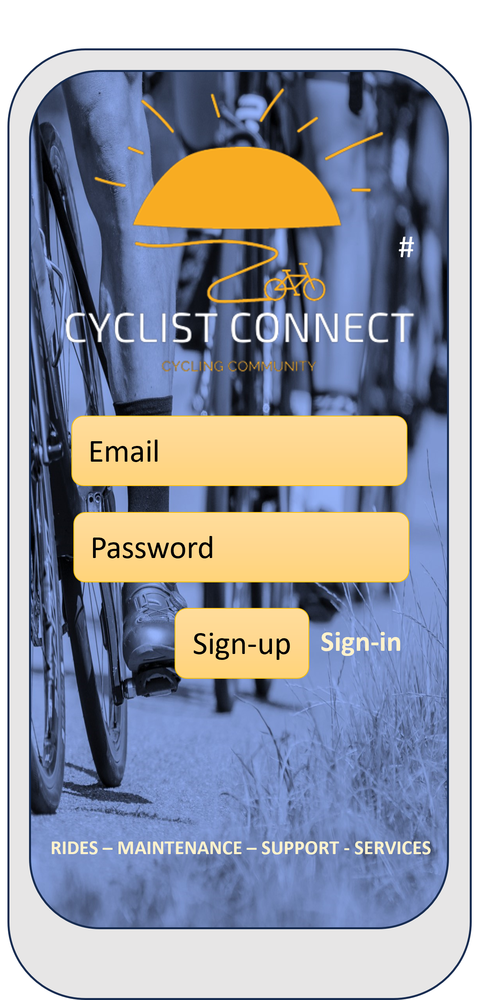

# cycle-connect
<logo image>
/workspace/cycle-connect/static/images/cc-logo-blue-text.png

A mini-social-networking site for cycling enthusiasts to build and enjoy their community of riders.
A link to the deployed project can be found here https://cycle-connect-70cef323855a.herokuapp.com

<images of the deployed site across different devices>

## Problem statement
To address the need for a website to connect fellow cyclists, allowing them to share experiences and find helpful information to improve their cycling journey. Cyclists need a website that allows the creation of a secure personal profile, a place to discuss bike maintenance and other cycling related topics, discover new cycling routes, plan and join group rides, buy and sell bikes and cycling related items, and book cycling related services easily. 
This website should help all users to feel like they are part of a friendly cycling community, keeping them motivated and informated for their cycling adventures.

## Initial proposed database structure to meet the problem statement
<image of database structure>

### Explanation of the data relationships:
Each user can create multiple posts, and each post belongs to one user (one-to-many relationship between Users and Posts).
Users can have multiple bikes for sale, and each bike belongs to one user (one-to-many relationship between Users and Bikes).
Users can make multiple bookings for services, and each booking belongs to one user (one-to-many relationship between Users and Bookings).
GroupCycles are organised by users, and users can participate in multiple group cycles (one-to-many relationship between Users and GroupCycles, many-to-many relationship between GroupCycles and Users through the Participants table).

## Design and development of themes and project as a whole
### Initial ideas
The site needed to feel clean and professional, preferably making use of motivational cycling images in the background. 
Information needed to be easy to find and the site easy to navigate. 
Themes of outdoor adventure were used from the outset and the logo design.

### Wireframes and initial mock-ups

### Colour schemes and background images
The site colour schemes was XXX

A selection of background images were obtained from Freepik (references below). These were recoloured in PowerPoint to keep with the themes and colours decided. 
The navbar and footer were styled in dark colours with a consistent logo in the top left and the menu (changing to drop down on smaller screens) in the right. Social media links were placed in the footer.

### Common themes and navigation
Each app has a different background image (although the colours feel the same). Each of these background images behaves the same way. The buttons and links throughout the site are styled in a similar manner (with the same colours and hover functions), and any pop-up modals used match. This is all with the aim to promote a positive UX throughout the site. 

## Division of the Django project into specific 'Apps'
From the database structure, the apps were decided and worked on individually. The initial minimum viable product set up was to ensure that users could sign-up with a mini-profile and then be able to write, update and delete posts on the user forum, and read and like the posts of others. 

The site was then developed further to incorporate services and bookings, marketplace, and social rides apps. A separate small app was created for adding a terms and conditions page.

### Profile and profile services
#### Purpose
A first time user can easily sign-up to the site

#### UX/UI key features

#### Tests (full details in separate documentation)

### Main user forum
#### Purpose

#### UX/UI key features

#### Tests (full details in separate documentation)

### User Market
#### Purpose

#### UX/UI key features

#### Tests (full details in separate documentation)

### Bookable company services
#### Purpose

#### UX/UI key features

#### Tests (full details in separate documentation)

### Group Cycles
#### Purpose

#### UX/UI key features

#### Tests (full details in separate documentation)

## Agile project planning and methodology
Initial collection of user stories were made, categorised for 'must', 'should' and 'could' and then used in conjunction with GitHub Projects.
Meeting the user stories was then planned with a series of goals, and then split down further into sprints. The proposed sprints were then met fully or partially, and any incomplete work was reassessed as to its value and where it should be placed.
### Sprint 1: Objectives - 

### Sprint 2: Objectives - 

### Sprint 3: Objectives - 

### Sprint 4: Objectives - 

## Main Technologies used

## Key issues and bugs
### Resolved

### Unresolved

## Potential future work beyond the scope of this project

## Deploying to Heroku

## Forking project
