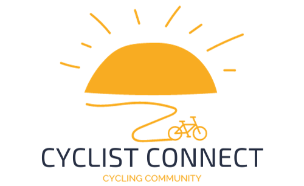
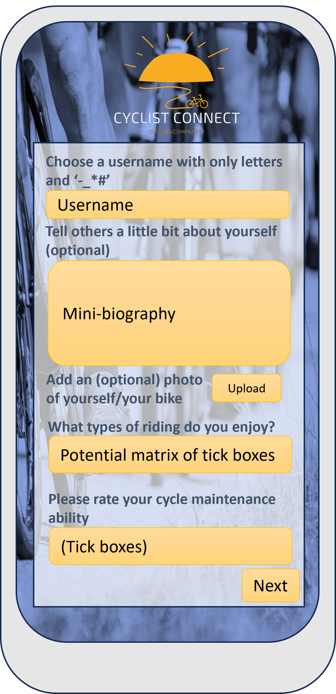
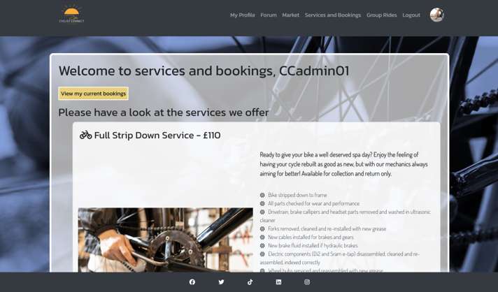

# cycle-connect

A mini-social-networking site for cycling enthusiasts to build and enjoy their community of riders.
A link to the deployed project can be found here https://cycle-connect-70cef323855a.herokuapp.com

## Problem statement
To address the need for a website to connect fellow cyclists, allowing them to share experiences and find helpful information to improve their cycling journey. Cyclists need a website that allows the creation of a secure personal profile, a place to discuss bike maintenance and other cycling related topics, discover new cycling routes, plan and join group rides, buy and sell bikes and cycling related items, and book cycling related services easily. 
This website should help all users to feel like they are part of a friendly cycling community, keeping them motivated and informated for their cycling adventures.

## Initial proposed database structure to meet the problem statement

### Explanation of the data relationships:
Each user can create multiple posts, and each post belongs to one user (one-to-many relationship between Users and Posts).
Users can have multiple bikes for sale, and each bike belongs to one user (one-to-many relationship between Users and Bikes).
Users can make multiple bookings for services, and each booking belongs to one user (one-to-many relationship between Users and Bookings).
GroupCycles are organised by users, and users can participate in multiple group cycles (one-to-many relationship between Users and GroupCycles, many-to-many relationship between GroupCycles and Users through the Participants table).

## Design and development of themes and project as a whole
### Initial ideas
The site needed to feel clean and professional, preferably making use of motivational cycling images in the background. 
Information needed to be easy to find and the site easy to navigate. 
Themes of outdoor adventure were used from the outset and the logo design.

### Wireframes and initial mock-ups
| Titles |  |  |
| ------ | ----- | ------ |
| Wireframes of layout for sign in and rides |  |  |
| Concept art login |  |  |
| Concept art sign-up |  |  |
| Concept art Ts and Cs/ forum entry |  |  |

### Colour schemes and background images
The site colour palette:
1. **Primary Colour - RGB(111, 111, 188):** This is a soft muted blue. It provides the backdrop for all pages and is used as the image overlay for all background images (applied in Microsoft PowerPoint).
2. **Accent Colour - RGBE(255, 221, 85, 0.7):** This is a semi-transparent golden-yellow to provide a strong contrast and draw the users attention to buttons and key navigational elements.
3. **White and Black:** These are used for text and borders and some background elements to ensure good readability.
4. **Warnings and Status Indicators:** These are in clear colours such as red, green, orange and yellow to give intuitive indication to the users.

A selection of background images were obtained from Freepik (references below). These were recoloured in PowerPoint to keep with the themes and colours decided. 
The navbar and footer were styled in dark colours with a consistent logo in the top left and the menu (changing to drop down on smaller screens) in the right. Social media links were placed in the footer.
The `background-attachment: fixed` property gives a parallax-like effect, adding depth to the pages.

### Typography
- **Primary Font - 'Dosis', sans-serif:** Used for most textual content of the site. This font has modern, clean lines.
- **Secondary Font - 'Kanit', sans-serif:** Used for headings, navigation, and certain buttons. This provides a subtle contrast to the main body text while maintaining overall harmony.

### Common themes and navigation
Each app has a different background image (although the colours feel the same). Each of these background images behaves the same way. The buttons and links throughout the site are styled in a similar manner (with the same colours and hover functions), and any pop-up modals used match. This is all with the aim to promote a positive UX throughout the site. 

### General accessibity and responsiveness checks
#### Code validation
The site was passed through HTML and CSS checks from W3 Schools with no issues. 
Lighthouse was used to check general accessibility:

The JavaScript passed through JSHint with no issues.

## Division of the Django project into specific 'Apps'
From the database structure, the apps were decided and worked on individually. The initial minimum viable product set up was to ensure that users could sign-up with a mini-profile and then be able to write, update and delete posts on the user forum, and read and like the posts of others. 

The site was then developed further to incorporate services and bookings, marketplace, and social rides apps. A separate small app was created for adding a terms and conditions page.

### Profile and profile services
#### Purpose
A first time user can easily sign-up to the site and immediately feel involved.

#### UX/UI key features
| Feature | Image | Description |
| ---- | ---- | ---- |
| Login screen |  | Clear layout where existing users can sign-in and new users can click to sign-up. |
| Initial sign-up screen |  | The site only requires a username and a password (entered twice). |
| Ts and Cs |    | A very basic user agreement is generated for the user to sign. The user is unable to access any other features until this is done using Django Middleware. Admin has a list of the users who have agreed to the terms. |
| Ts and Cs (base of form) |  | It is easy for the user to agree to the conditions on the form. |
| Detailed profile form |  | A first time user can feel involved with the site from the outset as they are invited to share a bit about their cycling background. They can also skip the form and go straight into the site if they wish, accommodating for users who might want to do this later, or simply are not interested in this piece of functionality. The profile pictures are used for the trading conversations part of the site and the top right corner to show the user is logged in. The form has one longer input field, some radio buttons and a thumbnail display of any uploaded images for the user to check their inputs.|
| Profile details view |  | The user can see their profile at any time by clicking on the profile link or their profile picture in the top right hand corner of any logged in page. This profile is currently private to the user (aside from the profile picture), but there is room to add future functionality here in sharing profiles, cross-referencing skills to social ride sign-ups and even targeting discussions regarding maintenance. |

#### Tests (full details in separate documentation)
Basic functionality of the two apps which the user interacts with at this point in the site
| Test | Pass? |
| ---- | ---- |
| Sign-in page loads | Yes |
| Returning user can sign in and is redirected to the forum | Yes |
| First time user can read and consent to Ts and Cs | Yes |
| First time user can set-up a basic sign-in. They can choose whether to do the detailed sign-up. | Yes |
| User can view and edit profile as required. | Yes |

Basic functionaity of admin interfaces
| Test | Pass? |
| ---- | ---- |
| Admin can access a list of accounts | Yes |
| Admin can see users who have agreed to the terms and conditions | Yes |

Full details [here](/TESTDETAILS.md)

### Main user forum
#### Purpose
The main userforum is where the cyclists can bring up and discuss any topics of their choosing, including bike types, interesting cycle routes and upcoming races/events. 
 
The page is self-monitoring and users can report posts that go against community standards. The decision was taken not to require admin approval to post on this page in order to allow the site users to be immediately involved in discussions and posts.

#### UX/UI key features
| Feature | Image | Description |
| ---- | ---- | ---- |
| Forum welcome and main page |   | The forum is designed to be dynamic and interactive. Users can add posts straight from the page and see them instantly appear below. Posts are organised from newest to oldest. The input field allows rich text input, as well as images and links. Additionally there is a built-in spell check for English, so users can check the content of their message before they post it. |
| Forum main page - posts and pagination |  | Users can interact with other posts on the page using the ‘like’ button. They can also see how many comments there already are for any particular post and can then open a new page for each post to view the comments and add their own if they wish. There is a limit to the number of posts displayed on the pages to prevent information overload. |
| Post editing |  | Any post made by the user can be edited, this form also checks for valid inputs. Users can navigate away from this page without making changes if they wish. |
| Post deletion |  | Users can choose to delete their own posts at will, and this page confirms this is the intended action. Deleted posts are removed from the database, along with any associated comments. |
| Commenting on posts |  | Users can comment on the posts of others join the discussion of a post in this thread. The posts are displayed with the comments. Users are able to edit their own comments if required. |
| Deleting comments on posts |  | Users can delete their own comments if they wish. A similar confirmation of action is required to the main forum post deletion. Deleted comments are also removed from the database. |
| Post reporting verification |  | Users who report posts using the 'report' button are required to verify this action, because it will remove the post from the forum, alongside all associated comments. It does not cause deletion of the post, so admin can reinstate the post if it was done in error. |
| Reported post notification |  | The author of a reported post receives a warning on their post, which they are still able to see. It provides the option to contact admin if they believe it was reported in error. This prevents user confusion of their post simply vanishing. |

#### Tests (full details in separate documentation)
Basic UI functionality tests:
| Test | Pass? |
| ---- | ---- |
| User can read all the non-reported posts on the forum | Yes |
| Users can create, read, update and delete their own posts on the forum | Yes |
| Users can like and comment on the posts of other users (and their own) | Yes |
| Users can update and delete their comments | Yes |
| Users can report offensive or misleading posts to admin | Yes |
| Users receive notification if their post(s) has been reported | Yes |
 
Basic admin site functionality tests:
| Test | Pass? |
| ---- | ---- |
| Admin can see all posts and their status | Yes |
| Admin can re-publish posts which were reported in error | Yes |
 
Full details [here](/TESTDETAILS.md)

### User Market
#### Purpose
The market (or 'trading') app exists within the site to allow users to buy and sell specific cycling related items. It is not mandatory to add a price, because some users may simply wish to exchange items. Users can filter items by a few categories and their condition.

#### UX/UI key features
| Feature | Image | Description |
| ---- | ---- | ---- |
| Marketplace main page |  | For sale items are listed from newest to oldest and there are filters to help find what they may be looking for. There is no 'search' function other than the filters. Items for sale are clearly marked as 'available', which automatically toggles to 'sold' once the seller clicks the button to mark the item as sold. Images and descriptions of the items are presented in a clear and consistent manner. A place-holder image is used if the user does not upload an image. This is to encourage them to use a more meaningful image of their own. |
| Add item form |  | Users can add items using a simple, quick form. They have the option to mark the item as 'sold' from the outset, because they might be looking to show the sorts of items they have previously sold (although it is unlikely that many will want to do this). The form has defaults for the item type button, but not the condition. It is important that the user gives the condition some thought and the form will not validate until the enter an input. Users can see a thumbnail of the image they are uploading. They have the ability to navigate back to the Marketplace main page without adding and item if they wish. |
| Confirmation of item submission |  | In order to align with the user story for admin being able to oversee the activity on the marketplace, and to verify the items being sold are appropriate for the site, items need to be verified. This is briefly explained to the user when they add an item for sale using a pop-up modal. |
| Post pending admin verification |  | The added posts are marked as pending for the author, but other users are unable to see the marketplace posts until they are verified by the admin. The pending posts are clearly marked with indicators, which are removed when the post is verified. |
| Edit their own post |  | Users can edit their marketplace posts using the straightforward form. Uploaded images can be seen on the thumbnails provided. |
| Delete their own post |  | Users can delete their items. This action also clears any of the chats associated with the items. |
| Interest and conversation buttons |  | If a potential buyer user starts a conversation with a vendor user, the 'start conversation' button changes text to 'continue conversation', making it easy to keep track of which items have on-going dialogue. For the vendor user, as they are approached with conversations from potential buyers, a list of the interested buyers appears below their item, which are all rendered as buttons which link straight to those conversations. This makes it easy for the seller to gauge interest in the item. |
| Conversation view for the items |  | Users can converse about the item in a private space, so they can haggle price, discuss delivery and payment options, without other users being able to read the details of their conversations. The profile pictures were added to these conversations to make the transactions feel more personal, which is important in a buying/selling situation. |

#### Tests (full details in separate documentation)
Basic UI functionality:
| Test | Pass? |
| ---- | ---- |
| Users  can browse a list of items they may wish to purchase | Yes |
| Users can apporach the seller of the items they are interested in | Yes |
| Users can easily list items for sale. Items can be edited and deleted | Yes |
| Users can toggle the sold/available state of their items | Yes |
 
Basic admin site functionality tests:
| Test | Pass? |
| ---- | ---- |
| Admin can see a list of added posts and verify suitable ones for publishing | Yes |
 
Full details [here](/TESTDETAILS.md)

### Bookable company services
#### Purpose
This part of the site links to the company providing the site, allowing for services to be booked for more local riders. This section of the site is not necessarily intended for all of the users.

#### UX/UI key features
| Feature | Image | Description |
| ---- | ---- | ---- |
| Services list |  | Users are able to see a list of the services and the descriptions. They can opt to view the locations where those services have active bookings from this page. |
| Location selection |  | Users are shown any places with active available bookings, and the number of slots currently available at that location. The user can select from these if there are more than one available. |
| Confirm intended booking |  | The user is presented with a lists of times and dates available for the service they wish to book at the location they selected on the previous screen. They have clear buttons to click to proceed with the booking. |
| Booking confirmation |  | Users receive a confirmation that their booking has been acknowledged, but that the current status is 'pending'. The status of the booking will be updated by the admin. This is necessary so that the admin can add the booking to their own diary, becayse the system is not integrated with a company calendar. |
| Booking list |  | Users can view a full list of bookings they have made, and the status of these bookings. The statuses are written and colour coded in order to not be ambiguous. Users can cancel their bookings from this page if required. |
| Confirm cancel |  | Users are asked to confirm cancelling the services (to prevent accidental cancellations). This redirects to the bookings list page, so the user receives instant feedback of the successful cancellation. |

#### Tests (full details in separate documentation)
Basic UI functionality:
| Test | Pass? |
| ---- | ---- |
| Users can view and book services | Yes |
| Users can can cancel booked services and receive confirmation of their action | Yes |
 

Basic admin site functionality tests:
| Test | Pass? |
| ---- | ---- |
| Admin can add new services, locations and booking slots which will render on the front end of the site | Yes |
| Admin can see new bookings | Yes |
| Admin can update bookings to 'confirmed' | Yes |
 
Full details [here](/TESTDETAILS.md)

### Group Cycles
#### Purpose
Users can view rides which have been planned or added by themselves or other users (or admin). They can sign up to upcoming rides and receive a running total of the rides they have attended. Uploaded images need to be sourced from other places and saved to be uploaded here.

#### UX/UI key features
| Feature | Image | Description |
| ---- | ---- | ---- |
| Group rides main page |  | On this page users can browse upcoming suggested group rides, which are organised according to date. They can also see past rides, which may add to their own riding inspiration. Rides which they have signed up for gain a bike symbol next to the name. This means that at a glance they can see what they were planning to be involved with, or did in the past. The button to add a new ride is clear, and the ability to amend their own rides (specifically to cancel verified rides) is clear when they were the organiser. Additionally the users can see the number of rides they have attended clearly displayed in the top right-hand corner. |
| Past rides on the main page |  | The users can see which rides they participated in in the list of past rides, and look at the details of the rides if they want inspiration for their own future plans. |  
| Detailed view of individual ride and one-click sign-up |  | Users can see the full detail of a ride they might be interested in. If they decide they want to join that ride, they can add themselves to the list by clicking the button. |
| Signed-up view |  | Once the user opts into a ride, their name appears in the list, marked with a bike so they can find themself quickly. The text in the button changes, and clicking the button again removes them from the list. |
| Create ride |  | The form has a few straightforward input fields, including an image. Users enter the details of the ride route and any additional information such as ease of parking and places to socailise afterwards. The date input cannot be in the past and the time input has to be a valid time. |
| Cancel ride |  | Creators of the rides can cancel them up until the point the ride would occur. Past rides cannot be cancelled. Once a ride is verified, it can only be cancelled and not deleted or edited. This is to safeguard against user confusion if they sign-up to rides or put details in their plans. |
| Cancelled ride in detail view |  | A cancelled ride is clearly shown so that there is no confusion. |
| Cancelled ride in list |  | Cancelled rides clearly show on the list at a glance. A user can see quickly if their symbol is against a cancelled ride and adjust their plans accordingly. |
| Edit ride |  | Rides with edit permissions (ie ones which are still 'pending') can have details edited and updated if required. Any field in the form can be changed. |
| Register view |  | The list of signed-up users is automatically rendered into a register once the ride has become 'in the past'. The ride organiser simply has to click a button from the detailed ride view, and then add checks next to the usernames of the riders who came. This then updates the total on the main page of the rides. |
| Pop-up modal to thank the user for adding the ride and explaining the 'pending' status |  | Admin and other designated 'trusted planners' (which can be toggled quickly and easily by site admin) are able to create verified rides from the outset. These rides instantly show to all users. When other users create rides, they are shown as 'pending' while they wait for admin approval. This pop-up modal explains the process to the user. |
| Rides showing as pending in the main list |  | When an added ride is still pending, only the ride creator can see the ride in the list. It is clearly marked as 'pending'. These labels go away once the ride is marked as verified, and at that point all other site users have the ability to view and book onto the ride if they wish. |
| Delete ride confirmation |  | Users can delete unverified rides if they wish. This is confirmed before it is carried out. |

#### Tests (full details in separate documentation)
Basic UI functionality:
| Test | Pass? |
| ---- | ---- |
| Users can see upcoming rides, and can book onto ones with space | Yes |
| Users can easily see which rides they are booked onto | Yes |
| Users can easily cancel bookings | Yes |
| Users can be confirmed as attending social rides, and can view a total of their achievements | Yes |
| Users can add and cancel rides easily | Yes |
| Users can edit and delete rides until they are verified by admin | Yes |
 

Basic admin site functionality tests:
| Test | Pass? |
| ---- | ---- |
| Admin can check and verify user added rides | Yes |
| Admin can add rides from the admin panel or the front end without requiring further validation | Yes |
| Admin can designate certain users as 'trusted organisers' whose rides need no further validation | Yes |
 
Full details [here](/TESTDETAILS.md)

## Agile project planning and methodology
Initial collection of user stories were made, categorised for 'must', 'should' and 'could' and then used in conjunction with GitHub Projects. 
The user stories were prepared and placed on the Kanban Board for my GitHub Project: https://github.com/users/ajmccredie/projects/2/views/1  
Meeting the user stories was then planned with a series of goals, and then split down further into sprints. The proposed sprints were then met fully or partially, and any incomplete work was reassessed as to its value and where it should be placed.
 

| User story | Must/should/ could | Database section | Time-box allocation/ Story points |
| ----------- | ----------- | ----------- | ----------- |
| As a **site admin**, I can **manage user accounts and profiles** so that **I can ensure the platform’s security and integrity**.      | Must | Userprofile, Forum, Trading | 8-13 |
| As a **site user**, I can **create, view, and update my profile** so that **I can share my cycling interests and connect with other riders.** | Must | Userprofile | 5 |
| As a **site admin**, I can **check and verify the content of posts** so that **the community standards can be upheld, and no misleading or offensive information is published.** | Should. Was reviewed in development and altered to the ability to report posts and have them removed pending review. This keeps the feel of the forum more dynamic. | Userprofile | 2 |
| As a **site user**, I can **post maintenance tips and tricks** so that **I can help fellow cyclists with their cycle maintenance.** | Must | Forum | 3 |
| As a **site user**, I can **post to ask the advice of others in the community** so that **my cycling can improve.** | Must | Forum | 3 |
| As a **site user**, I can **like the posts of others** so that **I can encourage them in the cycling community and feel involved.** | Should | Forum | 2 |
| As a **site user**, I can **comment on the posts of others** so that **I can feel involved in the conversation.** | Should | Forum | 3 |
| As a **site user**, I can **post some of my favourite route suggestions** so that **I can help inspire my fellow cyclists.** | Should | Forum (these are just suggestions rather than planning group rides) | 5 (to include the ability to search for the routes) |
| As a **site user**, I can **list bikes and components for sale** so that **I can find buyers for my items or purchase what I need.** | Must | Trading | 5 |
| As a **site admin**, I can **monitor and support the marketplace listings** so that **users can buy and sell items without issues.** | Must | Trading | 3 |
| As a **site user**, I can **immediately show if an item I had listed for sale is no longer available** so that **I do not waste the time of other users who would otherwise have liked to purchase the item.** | Should | Trading | 2 |
| (As a **site user**, I can **approach the sellers of bikes and components for sale** so that **I can find items or purchase what I need.**) | Must (but added in the sprint) | Trading | 5 |
| As a **site user**, I can **easily upload images for marketplace items** so that **I can generate more interest in the item.** | Could | Trading | 2 |
| As a **site user**, I can **make, check, and amend bookings for cycling-related services** so that **I can get the support I need for my cycling.** | Must | Bookings and Services | 8 |
| As a **site admin**, I can **handle user inquiries and issues related to service bookings** so that **users have a smooth experience.** | Must | Bookings and Services | 5 |
| As a **site user** I can **see the status of my booking requests** so that **I can be reassured of progress** | Should | Bookings and Services | 3 |
| As a **site admin**, I can **create, read, update, and delete the general services offered** so that **the information is up-to-date and correct, and bookings can be made.** | Should | Bookings and Services | 3 |
| As a **site user**, I can **plan and join group rides** so that **I can enjoy cycling with others.** | Must | Social Rides | 8 |
| As a **site admin**, I can **approve and manage group cycling events** so that **I can facilitate safe and organized rides.** | Must | Social Rides | 5 |
| As a **site user**, I can **view and RSVP to upcoming group cycling events** so that **I can participate in local rides.** | Must | Social Rides | 3 |
| As a **site user**, I can **earn badges or achievements based on my cycling milestones** so that **I can visualize and share my cycling experience.** | Could | Social Rides | 3 |
| As a **site admin**, I can **host virtual cycling challenges or competitions** so that **users can compete and stay engaged.** | Could | Social Rides/ Forum | 3 |
| As a **site user/admin**, I can **send invites to join the platform through text and emails** so that **the community can grow more quickly.** | Could | Userprofile | 8 |

The data relationship model was prepared and verified prior to the sprints.

### Sprint 1: Objectives - 
Getting a minimum viable product (MVP) in place: users can sign-up, set up an account, login, logout and use the forum. Within the forum users have full 'CRUD' (Create, Read, Update and Delete) capabilities of their own posts and add images. Admin can oversee the forum activity. Create test groups and user profiles to use on the site. Deploy to Heroku.
#### Definition of done for Sprint 1: 
A MVP site deployed to Heroku with full CRUD capability in the forum.
#### Break down of work goals to meet objectives and the user stories at the top of the table (not the optional ones at the bottom):
Goal 1: Set-up the project on GitHub and transfer user stories into Kanban Projects board in GitHub. Move the essential user stories relating to profile and forum into the 'Working on' column. 
Goal 2: Set-up the Django project for the site (as per the CodeStar Blog walkthough), set-up a superuser, and check admin access.  
Goal 3: Initial deployment and set-up in Heroku 
Goal 4: Set-up apps and database for the user account/profile. 
Goal 5: Design wire frames and concept art for site 
Goal 6: Create tests for minimum functionality (create, view, update and delete accounts, create, view, update and delete posts on the forum, including images) 
Goal 7: Create html and css for login and basic account set-up (adaptation of existing forms for sign-up to accept additional profile information). Use of crispy-forms? There will be button use and toggle similar to Hello Django. Consider multiple choice buttons as well as free text input for fields. 
Goal 8: Set-up the app and models for the data in main user forum. This will take a similar form and structure initially to CodeStar blog. 
Goal 9: Link up html and css to the forum 
Goal 10: Check the link up and the admin capabilities 
*Goal 11: Set-up user likes for posts on the forum 
*Goal 12: Add commenting ability and CRUD capability to comments 
Goal 13: Deploy MVP site to Heroku 
Goal 14: Full-testing of key-feature behaviour to check capability 
Goal 15: Create user groups and profiles. 
 

#### Analysis of the sprint (lessons learned):
The initial time-boxing points were not very accurate, and many of these goals took a disproportionate amount of time to complete. This sprint took far longer than intended to reach the MVP and therefore to meet the Definition of Done.  
Lessons were learned due to the overly ambitious nature and not fully understanding  many of the Django features. The Userforum was mainly based on walk-through code, which I thought would have been easier to have customised for my requirements. Initially many lessons were learned about how to better interpret the Debug error messages and how to solve issues of getting templates, urls, views, models, forms and admin files to all work effectively together. The first sprint took around double the amount of time which had been predicted from previous experience, but the majority of the planned work was necessary to complete in order to make a Minimum Viable Product (and therefore meet the Definition of Done for that sprint). 
Testing found some bugs, some of which required immmediate tackling. Some ideas to improve UX/UI were identified and listed to be potentially added to future sprint backlogs (in order of importance):
- Fully consistent application of CSS on pages
- Pagination of posts
- Admin verification of posts
- Categorisation or search function for posts
- Thumbnails of images in profiles
- JavaScript feedback messages confirming user actions
- Feedback to user regarding upload image size

### Sprint 2: Objectives - 
Add ability for users to view the services available for booking, make appropriate bookings and cancel bookings. Admin must be able to set the services up in the admin panel in a straightforward manner, and must confirm bookings for the users. It is important that service slots cannot be double booked, and take into account where the set-up or collection and returns of bikes are intended for on each day.
#### Definition of done for Sprint 2: 
A bookings system for services offered with full CRUD capability for both site admin and user.
#### Break down of goals meet objectives and the user stories regarding bookings and services:
Goal 1: Set up the app for the additional services offered 
Goal 2: Design the page and information flow structure 
Goal 3: Create a list of tests for the app to pass for this sprint to meet the definition of done 
Goal 4: Create models 
Goal 5: Create forms 
Goal 6: Allow for admin to mark when particular things are available for booking 
Goal 7: Link the mobile service details to the admin calendar 
Goal 8: Make and link up all the html template pages and view 
Goal 9: Write the css and the js 
Goal 10: Produce specific enquiries forms and fill in all the details (bikes and pedibus details – lift from cycool site, including images) 
* ~~Goal 11: Link enquiry forms up to email service and test X NO EMAIL FORM~~ – add to ‘nice to haves’ 
Goal 12: full-testing 
Goal 13: Fix static files issues and deploy to Heroku
 

#### Analysis of sprint 2 and lessons learned:
The Definition of Done was met, and users were able to access a list of services, make, view, amend and delete their bookings. The static files issues were sorted and the site was successfully deployed to Heroku. 
Generally, this sprint went far better than the first one, and the story-points were more or less accurate. Some features were decided to be left (and possibly not picked up again), including integration of an email alert system for the admin. Major bugs were found and fixed in testing, but one minor bug being added for investigation on a later sprint. Other things identified for adding to the backlog to be addressed in a later sprint if appropriate are also listed below in order of importance to the project:
- Fixing the bug to make sure the slot count for the region is accurate (or remove the count)
- Adding improved formatting and potentially images to the services lists
- Pop-ups for user to confirm action for delete
- Message to user when status has been changed by admin (ie a ‘new’ sort of indication)
- Set up of a daily summary email for admin of any bookings requiring confirmation?

### Sprint 3: Objectives - 
Reuse a similar code to the userforum and layout for the UI for the ‘Market’. Users need to be able to list items for sale easily, browse and approach other users to buy items they are interested in. Find a way for users to connect directly when a sale is to be agreed.
#### Definition of Done for Sprint 3:
A marketplace where users have full CRUD capability for listings, and can approach other users to inquire about and purchase items of interest. 
#### Break down of goals meet objectives and the user stories regarding marketplace/trading app:
Goal 1: Set up the model for a ‘for sale’ item (include the CycleConnect logo as a default image which should be there for the users to be encouraged to change). Posts should have item, location, price, picture, categories (new/used, clothing/bike gear, etc), status (sold/available) 
Goal 2: Set up the views for the user market post (including admin verification from the outset) 
Goal 3: Set up urls and get the basic categorised posts working with images and suitable layout. Toggle of sold/available should work, as should the ability to CRUD items 
Goal 4: Set up the messaging for the posts (which are hidden to all the users except for the ones holding the conversation and admin). General users should be able to see the number of different users who are in conversation about the item, but not see the conversation (this needs to be added to user stories, because was not considered at project inception, but is absolutely essential) 
Goal 5: Set up the filter according to category (show only those items/those items first)
Goal 6: Items which are sold should drop to the bottom of the list, but not disappear immediately 
Goal 7: Sort pagination for the views 
Goal 8: Full testing of app and interactions.  
Goal 9: Use the success with the pagination, categorisation and the admin verification to look at the forum app and solve some of the issues 
Goal 10: Add a Ts&Cs to verify on first sign up. 
Goal 11: Add thumbnail of user image to the header on the pages. 
Goal 12: Full testing of additional work 

#### Analysis of sprint 3 and lessons learned:
The Definition of Done was met, and from the addition of the new user story regarding the conversations about the items, some new and interesting functionality was generated. It was hoped that 'user chat' functionality could be utilised for the sign-ups for Social Rides. The filtering worked well, as did the admin verification of the posts. 
Following the successful completion of the planned work comfortably within the time-box, some other goals were developed and added to the sprint backlog to meet other user stories, such as the admin control of the community standards of the site with the Ts and Cs. The general UX was improved through the pagnination across the pages with very long and overwhelming feeds, and adding the logged in user thumbnail helps to show the user they are logged in. These activities had low story-point values and were able to fit neatly into this sprint. 
The possibility of emails and notifications was researched, but these would require far greater allocations of story-points.  
There were no known serious bugs at this point in the development. 

### Sprint 4: Objectives - 
Add the ability for users and admin to create and suggest group rides and for users to be able to sign up for these. Pop-ups to confirm user actions. 

#### Definintion of Done for Sprint 4:
An app within the site where users can see upcoming rides and add themselves to the rides they want, if there is space available. CRUD capability for adding rides.

#### Break down of goals meet objectives and the user stories regarding social rides app:
Goal 1: Set up the model for a ‘group ride’ item (include a random map image as a default image which should be there for the users to be encouraged to change) as part of the set up form. Posts should have name, location, picture, good route description, start time, approximate difficulty, and 10 initially available slots (but if organised by someone other than admin it only shows 9, because it assumes the organiser is taking one of them) 
Goal 2: Set up the views for the user make, view and book rides (including admin verification from the outset) CRUD capability from the outset. 
Goal 3: Set up urls and get the basic posts working with images and suitable layout. Users sign up with logic similar to ‘likes’, but usernames who have signed on are listed 
Goal 4: Ensure that user can delete the planned ride (and this is clearly shown on the views of the ride). The creator of the ride should be able to edit the ride up until it is verified by the admin. 
~~Goal 4: Set up the group chat for the ride (amongst the users who have booked a place) X ~~
Goal 5: Set up so that organiser can verify attendance post ride. Allow users to have a count up of their number of completed rides (possibly display this somewhere on the group rides page or similar as a ‘badge of honour’) 
Goal 6: full-test for the social rides 
Goal 7: Bug fix for bookable slots in Services and Bookings  
Goal 8: General formatting of the whole site to improve UX
Goal 9: Remove debug mode and deploy to Heroku.

#### Analysis of sprint 4 and lessons learned:
The work met the Definition of Done. Rides could be added, viewed, updated and deleted as appropriate. Users could sign-up for rides or remove their sign-ups as appropriate. Rides which met their full allocation of people show as 'full'.
Some of the goals were implemented and then changed in the test environment. The addition of the random map was seen to be misleading, and so the field was made optional. Due to a bug being found after the completion of sprint 3, but before the majority of the work started for this sprint, some items were removed from the sprint backlog of goals (such as the 'group chat' function and the 'badges' for increased numbers of verified participations). Dealing with the bug was added to the time-box for this sprint, after the app had met its Definition of Done. 
Due to having a small amount of time leftover within this time-box, the goal 8 was extended to include the development of JavaScript pop-ups to explain user actions.
Minor bugs:
- The css for the counter was not very good on initial implementation and deployment.
- Loss of background images (images embedded within the css code), which required contact with tutor support after every single suggestion found on the internet was tried and failed. 
Further work with larger story point allocation arising from this sprint:
- The ability to add iFrames or links to sites where routes can be planned more effectively would improve this feature. At the moment the user is required to develop and plan their ride elsewhere, and then upload the image of the ride into the page.

### Sprint 5: Objectives - 
The final sprint focussed on tidying up and unifying the UX/UI throughout. Even more thorough testing and documentation was required in order to ensure that there were no bugs introduced through other actions. Dealing with appropriate user stories/work goals added to the product backlog.

#### Definition of Done for Sprint 5:
A working, fully deployed site and completed testing of forms and navigation throughout the site.

#### Breakdown of goals:
The work on the site was not intended to be intense at this stage, but rather fully testing and debugging the work completed so far.

The items which were added back to the product backlog in other sprints were assessed for story points and for how much added benefit they were likely to bring. 

The remainder of the work was to transfer the information gathered during testing and regarding the write ups of the sprints, key features and design and development into the README document in Markdown format.

Final view of Kanban Project Board:

#### Analysis of Sprint 5 and lessons learned:
The Definition of Done was met and the site's forms and navigation all work as expected under test. 

This sprint was mostly focussed on identifying and solving any issues which were not found during earlier functional tests. Issues were deliberately generated by assessing unlikely, but possible user inputs in form fields. Identifying the user stories which had been assigned to work on later, but would not be possible in the time frame was difficult. These were moved into 'not in this project'. The 'possible future work' section was then completed, detailing things which would improve the site for both the admin and the user.

## Main Technologies used
### Languages
- **Python** is the basis of the site logic and functionality.
- **HTML5** is used to create the templates for the UI.
- **CSS3** is used for the site styling.
- **JavaScript** is used to make the site more dynamic in places where the Python logic would require a separate page, for example this was mainly used to create modals for the users to confirm actions.

### Framewords and packages
- **Python Django 3.2.23** is the main Python web framework used to build the site. The apps are built within the central workspace.
- **Gunicorn 21.2.0** is a Python WSGI HTTP server for UNIX, providing a powerful interface for deploying Python web applications.
- **Bootstrap 4** is an open-source front-end framework for designing websites and web applications. It contains HTML, CSS, and JavaScript-based design templates for typography, forms, buttons, navigation, and other interface components, as well as optional JavaScript extensions. It 
- **Cloudinary 1.37.0** provides cloud storage for the image uploads on the site.
- **PostgreSQL Database** is more powerful than the inbuilt SQLite Django database. This handles all the storage of the information added on the site.
- **pyscopg2 2.9.9** is a PostgreSQL database adapter for Python, necessary for interfacing with PostgreSQL databases, commonly used in Django projects.
- **Whitenoise 6.6.0** allows the web app to serve its own static files, making it simpler to deploy Django apps without the need for configuring a separate static file server.
- **Django-allauth 0.58.2** is an integrated set of Django applications addressing authentication, registration, account management as well as third-party (social) account authentication. This is used to handle the sign up logic and could later be extended to include emails and password reset functionality.
- **Django-crispy-forms 1.14.0** is a Django utility that improves the UI and UX of the forms used. Whilst not used in every form field, it is used extensively throughout this project.
- **Django-summernote 0.8.20.0** is a Django application for integrating Summernote (a Bootstrap-based WYSIWYG text editor) into Django projects. Summernote provides the ability to add rich text to entries and was selected for use in the main forum due to the ability to add images directly through the editor. The fields the user can use were adapted from the documentation, and some redundant ones were removed.
- **Pillow 10.1.0** is A Python Imaging Library that adds image processing capabilities to the Python interpreter, essential for handling image fields in Django.

## Key issues and bugs
### Resolved
The majority of bugs were encountered due to typos in the code preventing the pages behaving as expected. Some of these took longer to find than others (such as issues in the CSS and some of the lesser-used features). Additionally, a number of minor issues were found from the logic, where irrelevant buttons were still visible. These were fixed in the template, ensuring that only the correct buttons were rendered to allow valid choices for the user (for example not being able to sign up to past social rides). 

The more persistent and time-consuming bugs are listed below:
1.	The first major bug encountered was the integration of the allauth files with my own templates and sorting the urls and the views to handle these appropriately. This required a good deal of reading information online and trying different things. As my familiarity with working in Django improved, this error later felt trivial, but at the time it took a large amount of effort to overcome.
2.	The initial issues of getting posts to show properly in the forum was overcome by creating and linking appropriate templates and views. Again, this was down to my inexperience of working with Django and was not an issue moving forward.
3.	When the site was first deployed to Heroku, the static files (images and css) were lost. This was fixed by adding Whitenoise.
4.	Initially the ‘likes’ were not behaving as expected. This was fixed using HttpResponseRedirect. There were then weird drop down lists of users appearing by the ‘likes’ on the front end. These were produced in the forum comments view initially. These were removed using a ‘pop’ statement in the views.py.
5.	One of the profile forms was originally going to have multiple tick boxes (preferred ride type), but this feature did not work as intended. Rather than continue to try to fix the issue, the feature was re-evaluated and it was decided that radio button inputs would not damage the UI, so these were used instead.
6.	There were a number of issues with registering users to the site and the need for appropriate redirection upon first login. This was fixed by ensuring correct direction logic in the templates, views and urls.
7.	Services and bookings issues – slot count not consistently giving accurate results initially. Services with multiple places were not able to have more than one booking assigned to them. This was found to be down to a fundamental error in the way the service code was set up and bookings were assigned. The code for individual bookings was restored (after trying a few different methods to fix the issue) and it was decided that a form of the social rides booking code could be adapted in the future to allow a different booking mechanism for the group excursions. This issue was found late on in testing toward the end of the project. I tried removing much of the existing structure to replace with something far simpler, but was still facing a number of issues, mostly the inability to migrate any further models. I had given a bad ‘default’ value in the command prompt, and I did not know how to fix it. Consequently, my simpler approach may have worked, but I was unable to implement and test the models. I had to leave this issue on a few occasions and think about how better to resolve it. Eventually I had basically decided to delete the entire services and bookings app and start again with it, however that gave me the confidence to try doing something which I was convinced would break the whole thing: I went into the migration code in the app (guided by the error messages in the terminal) and found and changed the problematic default values. This then resolved the issue of not allowing migrations. I then replaced all the code I had being trying to use to resolve the issue with my own code from when the service bookings worked. For the time being there are no group bookings to make on the site, but new code would be required to add and use these bookings in the future, because the existing code cannot handle multiple sign-ups to a single event. Further work was still required and the models were updated to add ‘available’ and ‘booked’ to the fields. This was then integrated and eventually the page now works and shows the correct number of bookable slots for a location and then only loads available slots on the next page.
8.	An ‘integrity error’ was found in the Ts and Cs during testing, this was fixed by simply adding a null=False clause. There was also an issue initially with an incorrect redirect after agreeing to the terms, but this was fixed through updating the logic in the templates and the views.
9.	Pagination for the forum was an intermittent issue. This was caused by refactoring the views class for the forum to be a ListView in order to streamline and solve another issue. It was later changed back to View and the other issues resolved around that, allowing pagination to work appropriately.
10.	The issue of reappearing reported posts was also fixed through moving the class back to ‘View’ and controlling the logic more explicitly. 
11.	Form validation was mostly straightforward, however the main forum page summernote editor proved to be more difficult than the others. This was fixed in the end by creating an alert to display. However, when this was first used, it created other issues on the page. These were eventually resolved with a full-scale overhaul of the views for the forum. 
12.	Issues with forms and the ways they were displaying were initially fixed using the ‘FormHelper’, which was then extended to look at individual fields. This approach was also then taken in the templates and the increased control over the labels, inputs and validation overcame the majority of the issues faced.
13.	When the project was nearing completion and a deployment attempt was made in Heroku with `DEBUG=False` all the images called through the CSS (the background images) disappeared. The rest of the static files were fine. Eventually a fix was found with tutor support to upload those images to Cloudinary and call them into the background directly from there. 
14.	When one of the JavaScript modals was initially deployed, it was not functional. This was fixed by increasing the ‘z-index’ of the element in the CSS.
15. It was found that by editing the browser contents for navigation it was possible to access and edit the comments of others on the forum post and some other actions which were a site security risk. These were resolved by ensuring the views.py file contained better checks on the user identification. Some pages were then generating error 404s, so custom pages were developed for this to guide the users back to the forum.

### Unresolved
Some automated tests were written, but were not able to be used due to persistent issue in redirecting to the test database. I tried a number of fixes for this after extensive online research, but eventually decided to settle for manual testing. 

The form field being able to be submitted as blank and still start a conversation is a known bug, but removing the summernote field and replacing with a normal text field would remove the ability for the seller to send more pictures easily to the potential buyers if asked.

## Potential future work beyond the scope of this project
There were a few features which would propel this project to the point of being far more useful in the real world: 

The first would be to add email details on sign-up and allow email resets of passwords when users forget theirs. The emails could also be set up to align with user preferences to receive notification of site activity or of other upcoming events or new services offered by the site which may be of interest to the user. 

The notifications for the user was not possible within the time-frame. This was looked at on several occasions at different stages of the project, but there was just never quite enough time to implement and fully test this system. Ideally, the site would be able to show the user where changes had occurred that affected them. The simplest implementation of this would either be to display ‘new’ indicators on the menu items, or a symbol showing an update, which would disappear after they clicked on those parts of the site, or a ‘catch-up’ list that is displayed on login. The list could contain more details than simply the indicators, for example, how many likes a post they had made had received. 

A list of updates that would be most beneficial to the user would include:
- Whether anyone has liked/commented on their forum posts
- Whether a post has been removed/reported
- Whether there is anyone contacting them or any further new messages about an item they put up for sale/are trying to buy.
- Whether the status of a marketplace item they have put up for sale has been changed from ‘pending’ to ‘verified’
- Whether the status of any of their bookings has changed
- Whether a ride they have signed up to is now cancelled
- Whether they have a pending attendance register to complete for a ride they organised
- When they have been verified as attending a ride

The admin would also benefit from an easily accessible list of updates or actions required, as well as some basic indicators of site activity. An admin ‘dashboard’ could be developed which shows and provides easy links to the admin part of the site each of the following things:
- How many new posts/comments have been made in the forum (numerical or graphical information, not requiring action)
- How many logins there have been over a given period (numerical or graphical information, not requiring action)
- Whether a post has been reported
- Whether any new items have been added for sale and require verification
- Whether any new bookings have been made and require verification 
- Whether the number of uploaded ‘slots’ for booking is below a certain threshold value and a reminder to consider adding more.
- Whether any users have cancelled a booking
- Whether any new group rides have been planned and if any of these require verification
- How many group rides have been planned and the attendance figures for these (numerical or graphical information, not requiring action)

In order to allow the site to grow quickly, the ability for users to easily invite their friends using a simple sign up link on an email or text message would be good to implement. 

There is currently no easy way for a user to change their password either, so this should be incorporated into the site before any form of commercial launch would be possible.

Categorisation of the posts on the forum could also be a beneficial feature for the user, particularly as the forum expands (in addition to the general search bar). This could increase the speed at which they are able to access relevant information.

## Deploying to Heroku
1. Ensure that debug mode is set to 'False' in the Django main apps 'settings.py'.
2. Install WhiteNoise `pip3 install whitenoise` and add 'WhiteNoiseMiddleware' to 'MIDDLEWARE' in 'settings.py'.
3. Configure static files in 'settings.py':
- `STATIC_URL = /static/`
- `STATIC_ROOT = BASE_DIR/'staticfiles`
- `STATICFILES_STORAGE = 'whitenoise.storage.CompressedManifestStaticFilesStorage'`
4. Check in the CSS file if any static images are called from your directory. For each of these, upload the file to Cloudinary and extract the direct link to the image. Replace your image url with this link.
5. Log in to your Heroku account and create a new app with a unique name and appropriate region.
6. Copy the link for the deployed site from Heroku Domains (in 'settings' link in Heroku) and ensure it is added to 'ALLOWED_HOSTS' in 'settings.py'.
7. In the app's 'Settings' tab, go to 'Config Vars':
- Add `PORT` with the value `8000`
- Add database credentials (eg `DATABASE_URL` for PostgreSQL)
- Add `CLOUDINARY_URL` with your Cloudinary credentials
- Add your `SECRET_KEY` 
8. Back in your code editor, run `pip3 freeze > requirements.txt` to save project dependencies.
9. Ensure all code is pushed to GitHub.
10. Back in Heroku, in 'Buildpacks' add 'Python' and 'Node.js', ensuring Python is listed first.
11. In the 'Deploy' tab, choose 'GitHub' as the deployment method and connect your GitHub account.
12. Select your repository and choose between automatic or manual deployment.
13. After deployment, test the project behaves as expected.

## Cloning this project
1. Navigate to the main repository page on GitHub.com
2. Select the ‘Code’ button above the list of files
3. Select between https, SSH or GitHub CLI
4. Click the clipboard icon to copy the URL
5. Open your code terminal
6. Navigate to the directory where you want to place the cloned project
7. Type ‘git clone’ in the terminal and then paste the URL copied in step 4.

## References 
### Code
Bootstrap navbar - https://getbootstrap.com/docs/4.0/components/navbar/ - Bootstrap Documentation (6th November).
 
 
Crispy forms general use, Helper, and data cleaning - https://django-crispy-forms.readthedocs.io/en/latest/form_helper.html - Crispy Forms Documentation (6th November).
 
 
Crispy forms layout helpers and widgets - https://simpleisbetterthancomplex.com/tutorial/2018/11/28/advanced-form-rendering-with-django-crispy-forms.html#crispy-forms-layout-helpers - Vitor Freitas (Nov 28th 2018) (6th November). 
 
 
Allauth sign-up and sign-out - https://docs.allauth.org/en/latest/account/views.html - Allauth Documentation (8th November).
  
'Semi-opaque box' CSS from my own code in the Code Institute's Halloween Hackathon 'BeetleJuice Curse Generator'
  
Initial set-up of the forum largely based on Code Institute's 'I Think, Therefore I Blog' Walkthrough code.
  
Help with use of logic in views for userprofile (after getting really stuck) from Chat-GPT AI. Code used to fix bug and then adapted (14th November).
  
Custom template tags for counting and comparing slots in booking. Use of Django's authentication. This was referred to frequently in User creation, authentication and use. Includes use of LoginRequiredMixin and the ModelBackend used to attempt a bug fix (later discarded) - https://docs.djangoproject.com/en/5.0/topics/auth/default/ - Django Documentation (16th November). 
  
Pagination based on walkthrough ('I Think, Therefore I Blog') and classes added to be able to style later (20th November)
  
Configurations for Django Summernote. Use shown in settings.py - https://github.com/summernote/django-summernote - Django-summernote on GitHub (20th November).
  
Use of Whitenoise to sort static files - 
https://devcenter.heroku.com/articles/django-assets - Heroku Help. https://devmaesters.com/blog/34 - DevMaesters. 
https://www.w3schools.com/django/django_static_whitenoise.php - W3Schools (22nd November).
  
MDN Web Docs Guides > Django Tutorial Part 9: Working with forms. For general advice, guidance and things to try when the error messages were flowing. Try/except statement fix in particular for the ProfileDetailsForm: https://developer.mozilla.org/en-US/docs/Learn/Server-side/Django/Forms (24th November).
  
Liked posts display partially from “I think therefore I blog”, with some other parts tried from Stack overflow: https://stackoverflow.com/questions/64997951/getting-all-the-users-name-who-liked-a-post-in-django - Stack Overflow (27th November).
  
More information used on querysets and Q - https://www.fullstackpython.com/django-db-models-query-q-examples.html - Fullstack Python, https://www.w3schools.com/django/django_queryset_filter.php - W3Schools (30th November).
  
Information and tutorial for sending information between the JS and the templates, and how the JSONResponse links into the views.py. Failed attempts at dynamic drop downs for services and bookings tried from: Sorting dynamic requests in Django for the bookings: AJAX - https://www.youtube.com/watch?v=QDdLvImfq_g - Django AJAX Tutorial: Basic AJAX in Django app | Django casts # (23rd November)
  
Chat GPT to try to solve the issues with the bookings forms: It generated the following lines of code which I used and appeared to be successful in fixing the problem (1st December): 
`If self.service:
		self.fields['service'].initial = self.service
		self.fields['service'].disabled = True
		# Assuming your Slot model has date and time fields
		self.fields['date'].queryset = self.service.slot_set.values_list('start_time__date', flat=True).distinct()
`
  
Chat GPT for how to create bicycle bullet points for my list in services and bookings. The start and finish of that code is clearly marked in the CSS file. (4th December)
  
I imported Pillow after reading some comments in various Python forums (and from the PP4 channel of the Code Institute’s Slack feed) to handle the images - https://realpython.com/image-processing-with-the-python-pillow-library/ - RealPython (4th December).
  
I asked Chat GPT how to best display the information in my template gathered from my form input radio buttons regarding status, condition and category. It suggested the use of ‘post.get_status_display’, which worked really well, so I also used this approach for category and condition. (5th December)
  
Toggling the status (sold or available) views code was run through Chat GPT again (after all the issues I had getting the ‘likes’ sorted for the forum posts). The use of ‘@require_POST’ and how to apply the subsequent logic was explained through the AI engine. I added my own variables and it worked really well.  (6th December).
  
Filters for the items developed from https://learndjango.com/tutorials/django-search-tutorial - Django Documentation (6th December and again on 9th December).
  
Use of Case/When - https://stackoverflow.com/questions/51165089/using-case-in-django - Stack Overflow (8th December).
  
Middleware requirements for ts and cs - https://django-termsandconditions.readthedocs.io/ - Django Read The Docs (9th December).
  
General set up of Ts and Cs - Users are asked to agree to terms and conditions for the site: https://www.youtube.com/watch?v=tR_z6mG1oe8 - Django Web App Beginner Tutorial: User Registration, Login, Logout, Terms Conditions - Skolo Online (9th December).
  
Using key.startswith to interpret the users on the ride, verify and save them with the logic from https://www.geeksforgeeks.org/python-prefix-key-match-in-dictionary/ Adding the prefixes inspired by https://www.geeksforgeeks.org/python-add-prefix-to-each-key-name-in-dictionary/, but heavily modified and simplified in the application. (14th December)
  
Timezone.make_aware and timezone.get_default_timezone() https://www.fullstackpython.com/django-utils-timezone-make-aware-examples.html (15th December)
  
Creating image thumbnails using JS: https://dev.to/pqina/generating-image-thumbnails-in-the-browser-using-javascript-and-filepond-10b8 and https://developer.mozilla.org/en-US/docs/Web/API/FileReader/readAsDataURL (17th December)
  
Using JavaScript to retrieve and compare date fields: https://phoenixnap.com/kb/how-to-get-the-current-date-and-time-javascript (18th December)
  

### Resources
#### General
Cycool (Oscar Voller) for text regarding services and general advice about the world of cycling and cyclists
  
Check and verification of initial data-model from Mentor Mitko Bachvarov
  
Project inspiration and general moral support from Sam O'Brian-Olinger
  
Code Institute Tutor Support - Deployment of project in non-Debug mode.
  
Ts and Cs text generated by Chat GPT after being given a rough outline of requirement from me. (9th December)

#### Images
Logo created by me in Canva Design: https://www.canva.com/design/
  
Database model created by me in Miro: https://miro.com/diagramming
  
Freepik used to obtain cycling images (listed below) and Microsoft Powerpoint used to apply the blue hues for the backgrounds
- "https://www.freepik.com/free-photo/panoramic-shot-bicycle-wheels-riding-ground_10944756.htm#position=1" >Image by wirestock
- "https://www.freepik.com/free-photo/travel-cycling-mountain-vacation-lifestyle_1088182.htm#position=6" >Image by jcomp
- "https://www.freepik.com/free-photo/medium-shot-family-cycling-outdoors_41254026.htm#position=10" >Freepik
- "https://www.freepik.com/free-photo/close-up-hand-working-with-wrench_13659143.htm#position=4" >Freepik
- "https://www.freepik.com/free-photo/close-up-man-riding-bicycle_14960786.htm#position=5" >Freepik
- "https://www.freepik.com/free-photo/close-up-bicycle-wheel_1807691.htm#position=7" >Freepik
- "https://www.freepik.com/free-photo/professional-cyclist-woman_31980761.htm#position=11" >Freepik
- "https://www.freepik.com/free-photo/cyclist-bycicle-race_11343802.htm#position=9" >Image by wirestock
- "https://www.freepik.com/free-photo/close-up-hand-working-with-tool_13659147.htm#query=bike%20service&position=20&from_view=keyword&track=ais&uuid=b6097f01-7194-4541-ba48-14fd73601b6b">Freepik
  
Map images created in Komoot: https://www.komoot.com
- https://www.komoot.com/smarttour/691915
- https://www.komoot.com/smarttour/4151103
- https://www.komoot.com/discover/Basildon/@51.6284395,0.4218142/tours?max_distance=4820&sport=touringbicycle&map=true