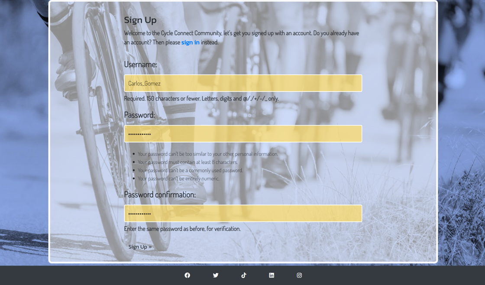
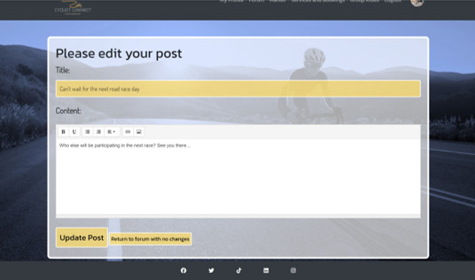

# cycle-connect

A mini-social-networking site for cycling enthusiasts to build and enjoy their community of riders.
A link to the deployed project can be found here [cycle-connect]https://cycle-connect-70cef323855a.herokuapp.com

<images of the deployed site across different devices>

## Problem statement
To address the need for a website to connect fellow cyclists, allowing them to share experiences and find helpful information to improve their cycling journey. Cyclists need a website that allows the creation of a secure personal profile, a place to discuss bike maintenance and other cycling related topics, discover new cycling routes, plan and join group rides, buy and sell bikes and cycling related items, and book cycling related services easily. 
This website should help all users to feel like they are part of a friendly cycling community, keeping them motivated and informated for their cycling adventures.

## Initial proposed database structure to meet the problem statement

### Explanation of the data relationships:
Each user can create multiple posts, and each post belongs to one user (one-to-many relationship between Users and Posts).
Users can have multiple bikes for sale, and each bike belongs to one user (one-to-many relationship between Users and Bikes).
Users can make multiple bookings for services, and each booking belongs to one user (one-to-many relationship between Users and Bookings).
GroupCycles are organised by users, and users can participate in multiple group cycles (one-to-many relationship between Users and GroupCycles, many-to-many relationship between GroupCycles and Users through the Participants table).

## Design and development of themes and project as a whole
### Initial ideas
The site needed to feel clean and professional, preferably making use of motivational cycling images in the background. 
Information needed to be easy to find and the site easy to navigate. 
Themes of outdoor adventure were used from the outset and the logo design.

### Wireframes and initial mock-ups
| Titles |  |  |
| ------ | ----- | ------ |
| Wireframes of layout for sign in and rides |  |  |
| Concept art login |  |  |
| Concept art sign-up |  |  |
| Concept art Ts and Cs/ forum entry |  |  |

### Colour schemes and background images
The site colour schemes was XXX

A selection of background images were obtained from Freepik (references below). These were recoloured in PowerPoint to keep with the themes and colours decided. 
The navbar and footer were styled in dark colours with a consistent logo in the top left and the menu (changing to drop down on smaller screens) in the right. Social media links were placed in the footer.

### Common themes and navigation
Each app has a different background image (although the colours feel the same). Each of these background images behaves the same way. The buttons and links throughout the site are styled in a similar manner (with the same colours and hover functions), and any pop-up modals used match. This is all with the aim to promote a positive UX throughout the site. 

## Division of the Django project into specific 'Apps'
From the database structure, the apps were decided and worked on individually. The initial minimum viable product set up was to ensure that users could sign-up with a mini-profile and then be able to write, update and delete posts on the user forum, and read and like the posts of others. 

The site was then developed further to incorporate services and bookings, marketplace, and social rides apps. A separate small app was created for adding a terms and conditions page.

### Profile and profile services
#### Purpose
A first time user can easily sign-up to the site and immediately feel involved.

#### UX/UI key features
| Feature | Image | Description |
| ---- | ---- | ---- |
| Login screen |  | Clear layout where existing users can sign-in and new users can click to sign-up. |
| Initial sign-up screen |  | The site only requires a username and a password (entered twice). |
| Ts and Cs | <image> | A very basic user agreement is generated for the user to sign. The user is unable to access any other features until this is done using Django Middleware. Admin has a list of the users who have agreed to the terms. |
| Detailed profile form |  | A first time user can feel involved with the site from the outset as they are invited to share a bit about their cycling background. They can also skip the form and go straight into the site if they wish, accommodating for users who might want to do this later, or simply are not interested in this piece of functionality. The profile pictures are used for the trading conversations part of the site and the top right corner to show the user is logged in. The form has one longer input field, some radio buttons and a thumbnail display of any uploaded images for the user to check their inputs.|
| Profile details view |  | The user can see their profile at any time by clicking on the profile link or their profile picture in the top right hand corner of any logged in page. This profile is currently private to the user (aside from the profile picture), but there is room to add future functionality here in sharing profiles, cross-referencing skills to social ride sign-ups and even targeting discussions regarding maintenance. |

#### Tests (full details in separate documentation)

### Main user forum
#### Purpose
The main userforum is where the cyclists can bring up and discuss any topics of their choosing, including bike types, interesting cycle routes and upcoming races/events. 

The page is self-monitoring and users can report posts that go against community standards. The decision was taken not to require admin approval to post on this page in order to allow the site users to be immediately involved in discussions and posts.

#### UX/UI key features
| Feature | Image | Description |
| ---- | ---- | ---- |
| Forum welcome and main page |   | The forum is designed to be dynamic and interactive. Users can add posts straight from the page and see them instantly appear below. Posts are organised from newest to oldest. The input field allows rich text input, as well as images and links. Additionally there is a built-in spell check for English, so users can check the content of their message before they post it. |
| Forum main page - posts and pagination |  | Users can interact with other posts on the page using the ‘like’ button. They can also see how many comments there already are for any particular post and can then open a new page for each post to view the comments and add their own if they wish. There is a limit to the number of posts displayed on the pages to prevent information overload. |
| Post editing |  | Any post made by the user can be edited, this form also checks for valid inputs. Users can navigate away from this page without making changes if they wish. |
| Post deletion |  | Users can choose to delete their own posts at will, and this page confirms this is the intended action. Deleted posts are removed from the database, along with any associated comments. |
| Commenting on posts |  | Users can comment on the posts of others join the discussion of a post in this thread. The posts are displayed with the comments. Users are able to edit their own comments if required. |
| Deleting comments on posts |  | Users can delete their own comments if they wish. A similar confirmation of action is required to the main forum post deletion. Deleted comments are also removed from the database. |
| Post reporting verification |  | Users who report posts using the 'report' button are required to verify this action, because it will remove the post from the forum, alongside all associated comments. It does not cause deletion of the post, so admin can reinstate the post if it was done in error. |
| Reported post notification |  | The author of a reported post receives a warning on their post, which they are still able to see. It provides the option to contact admin if they believe it was reported in error. This prevents user confusion of their post simply vanishing. |

#### Tests (full details in separate documentation)

### User Market
#### Purpose
The market (or 'trading') app exists within the site to allow users to buy and sell specific cycling related items. It is not mandatory to add a price, because some users may simply wish to exchange items. Users can filter items by a few categories and their condition.

#### UX/UI key features
| Feature | Image | Description |
| ---- | ---- | ---- |

#### Tests (full details in separate documentation)

### Bookable company services
#### Purpose

#### UX/UI key features

#### Tests (full details in separate documentation)

### Group Cycles
#### Purpose

#### UX/UI key features

#### Tests (full details in separate documentation)

## Agile project planning and methodology
Initial collection of user stories were made, categorised for 'must', 'should' and 'could' and then used in conjunction with GitHub Projects.
Meeting the user stories was then planned with a series of goals, and then split down further into sprints. The proposed sprints were then met fully or partially, and any incomplete work was reassessed as to its value and where it should be placed.

| User story | Must/should/ could | Database section | Time-box allocation/ Story points |
| ----------- | ----------- | ----------- | ----------- |
| As a **site admin**, I can **manage user accounts and profiles** so that **I can ensure the platform’s security and integrity**.      | Must | Userprofile, Forum, Trading | 8-13 |
| As a **site user**, I can **create, view, and update my profile** so that **I can share my cycling interests and connect with other riders.** | Must | Userprofile | 5 |
| As a **site admin**, I can **check and verify the content of posts** so that **the community standards can be upheld, and no misleading or offensive information is published.** | Should. Was reviewed in development and altered to the ability to report posts and have them removed pending review. This keeps the feel of the forum more dynamic. | Userprofile | 2 |
| As a **site user**, I can **post maintenance tips and tricks** so that **I can help fellow cyclists with their cycle maintenance.** | Must | Forum | 3 |
| As a **site user**, I can **post to ask the advice of others in the community** so that **my cycling can improve.** | Must | Forum | 3 |
| As a **site user**, I can **like the posts of others** so that **I can encourage them in the cycling community and feel involved.** | Should | Forum | 2 |

### Sprint 1: Objectives - 

### Sprint 2: Objectives - 

### Sprint 3: Objectives - 

### Sprint 4: Objectives - 

## Main Technologies used
- **Python Django 3.2.23** is the main Python web framework used to build the site. The apps are built within the central workspace.
- **Gunicorn 21.2.0** is a Python WSGI HTTP server for UNIX, providing a powerful interface for deploying Python web applications.
- **HTML5** is used to create the templates for the UI.
- **CSS3** is used for the site styling.
- **JavaScript** is used to make the site more dynamic in places where the Python logic would require a separate page, for example this was mainly used to create modals for the users to confirm actions.
- **Cloudinary 1.37.0** provides cloud storage for the image uploads on the site.
- **PostgreSQL Database** is more powerful than the inbuilt SQLite Django database. This handles all the storage of the information added on the site.
- **pyscopg2 2.9.9** is a PostgreSQL database adapter for Python, necessary for interfacing with PostgreSQL databases, commonly used in Django projects.
- **Whitenoise 6.6.0** allows the web app to serve its own static files, making it simpler to deploy Django apps without the need for configuring a separate static file server.
- **Django-allauth 0.58.2** is an integrated set of Django applications addressing authentication, registration, account management as well as third-party (social) account authentication. This is used to handle the sign up logic and could later be extended to include emails and password reset functionality.
- **Django-crispy-forms 1.14.0** is a Django utility that improves the UI and UX of the forms used. Whilst not used in every form field, it is used extensively throughout this project.
- **Django-summernote 0.8.20.0** is a Django application for integrating Summernote (a Bootstrap-based WYSIWYG text editor) into Django projects. Summernote provides the ability to add rich text to entries and was selected for use in the main forum due to the ability to add images directly through the editor. The fields the user can use were adapted from the documentation, and some redundant ones were removed.
- **Pillow 10.1.0** is A Python Imaging Library that adds image processing capabilities to the Python interpreter, essential for handling image fields in Django.

## Key issues and bugs
### Resolved

### Unresolved

## Potential future work beyond the scope of this project

## Deploying to Heroku
1. Ensure that debug mode is set to 'False' in the Django main apps 'settings.py'.
2. Install WhiteNoise `pip3 install whitenoise` and add 'WhiteNoiseMiddleware' to 'MIDDLEWARE' in 'settings.py'.
3. Configure static files in 'settings.py':
- `STATIC_URL = /static/`
- `STATIC_ROOT = BASE_DIR/'staticfiles`
- `STATICFILES_STORAGE = 'whitenoise.storage.CompressedManifestStaticFilesStorage'`
4. Check in the CSS file if any static images are called from your directory. For each of these, upload the file to Cloudinary and extract the direct link to the image. Replace your image url with this link.
5. Log in to your Heroku account and create a new app with a unique name and appropriate region.
6. Copy the link for the deployed site from Heroku Domains (in 'settings' link in Heroku) and ensure it is added to 'ALLOWED_HOSTS' in 'settings.py'.
7. In the app's 'Settings' tab, go to 'Config Vars':
- Add `PORT` with the value `8000`
- Add database credentials (eg `DATABASE_URL` for PostgreSQL)
- Add `CLOUDINARY_URL` with your Cloudinary credentials
- Add your `SECRET_KEY` 
8. Back in your code editor, run `pip3 freeze > requirements.txt` to save project dependencies.
9. Ensure all code is pushed to GitHub.
10. Back in Heroku, in 'Buildpacks' add 'Python' and 'Node.js', ensuring Python is listed first.
11. In the 'Deploy' tab, choose 'GitHub' as the deployment method and connect your GitHub account.
12. Select your repository and choose between automatic or manual deployment.
13. After deployment, test the project behaves as expected.

## Forking project
